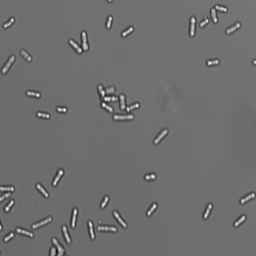
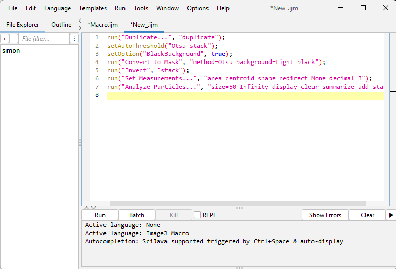
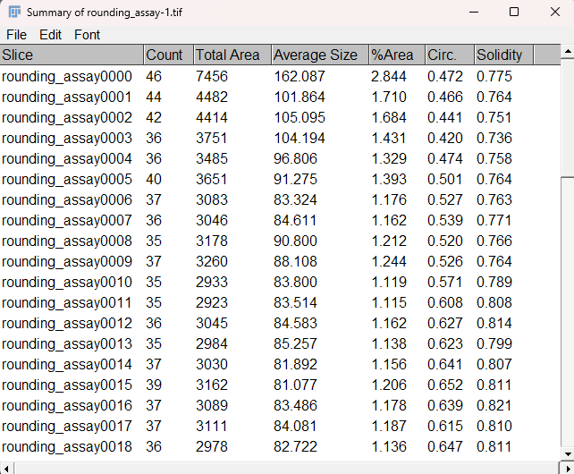
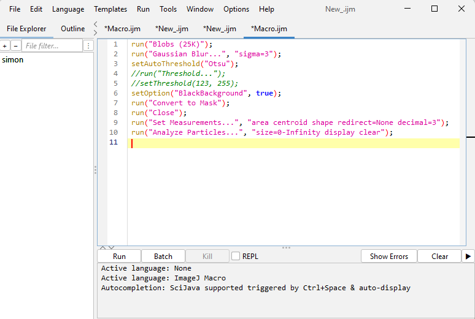
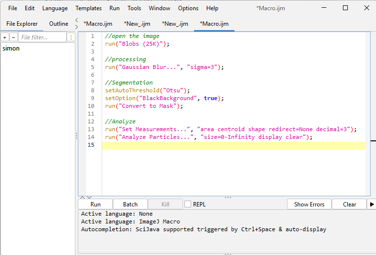
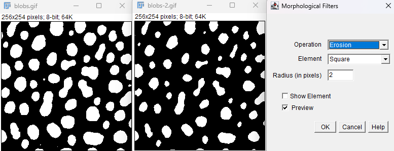
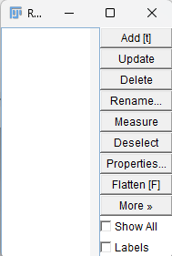
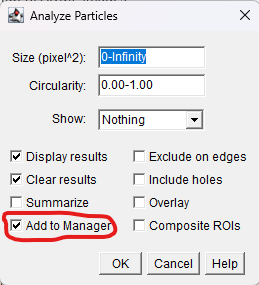
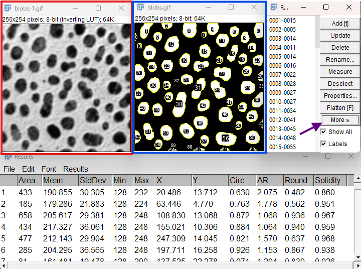
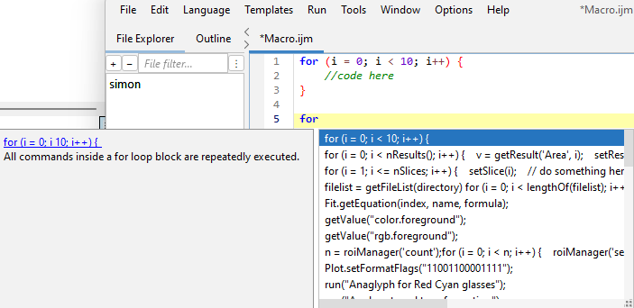

# Introductory Course to Image Analysis in Life Science using FiJi

**Important ressources:**
- ImageJ website for plugins: https://imagej.net/ij/
- Advice for macro writing: https://imagej.net/ij/developer/macro/macros.html
- **Built-in Macro function**: https://imagej.net/ij/developer/macro/functions.html


## Why scripting?
- Improve reproducibility on image analysis
- Automating repetitive tasks in image analysis
- Creating custom image processing workflows
- Batch processing large sets of images
- Extending ImageJ's functionality without writing Java plugins

A simple example, going from this movie of a bacterial 🦠 growth



To, with the help of a simple macro



At a result table showing the shape evolution of the bacterial population



The objective of this course is to learn the basic of ImageJ Macro language, with the almighty `Recorder` and the basic block of programmation such as `for` loop and `if` condition. At the end, **you** should have the tools and knowledge to be able to write your own macro!

## Requirement
- Have ImageJ or [Fiji](https://fiji.sc/) version 1.53t or later installed on your computer (Help=>Update)
- Download the [repositery](https://github.com/leclercsimon74/2024_Introductory-Course-to-Image-Analysis-in-Life-Science_FiJi/archive/refs/heads/main.zip) to have all images

## The basics
### Hello World!

```Java
// This is a comment. The script starts below.

// Print "Hello World!" to the log window
print("Hello World!");

// Show a dialog box with the message
showMessage("Greetings", "Hello World!");
```

In the code is presented 2️⃣ ways to display the classical `Hello World!`:

- the `print()` function, that will print the content between parenthesis in a log window
- the `showMessage()` function that will open an interactive window displaying the message, with a 🆗 button to continue the code

To run the macro, go to `Plugin` > `New` > `Macro`, copy-paste the code and click the `Run` button. Et voila!

In ImageJ Macro language, all variables needs to be declared:

```Java
// Initialization
a = 6;
b = 3.0;
c = "one";

// some operation
d = a + b;

// result
print(d);
```

There is multiple type of variable, such as integer (`a`) and float (`b`) numbers and string (`c`), a serie of letter. Some variable can be combined, while other cannot and will throw an error.

There is a nice selection of mathematical and string maniplation already defined in ImageJ to simplify our life.

On the mathematical side:
```Java
// Initialization
a = 6;
b = 3.0;

// Mathematical print
print(pow(a,b)); //a to the power of b
print(sqrt(a)); // square root
print(round(b)); // round
print(abs(-b)); // absolute
```

On the string side:
```Java
// Initialization
a = "Hello";
b = "World";

// string manipulation print
print(a+" "+b); // concatenate
print(substring(a, 2, 4)); // substring
print(replace(b, "ld", "m")); // replace
print(startsWith(a, "He")); // check the start of the string
print(endsWith(b, "ld")); // check the send of the string
```

Lucky for us, ImageJ have now a nice auto-completion system, that can be enable with `Ctrl+Space`, and which contain most commun expression.

### The Recorder
One of the strong point of ImageJ is how easy it is to use and protoype an image analysis pipeline. Once we have an idea of what to do with a given image, the easiest is to turn on the `Recorder` (`Plugins` > `Macros` > `Recorder`). The recorder will record _most_ of the action realized in ImageJ, from image opening to selecting a window or running some process.

Let's make our first full Macro!

1. Open the `Recorder` (`Plugins` > `Macros` > `Recorder`)
2. Open the Blobs image (`File` > `Open Sample` > `Blobs`)
3. Run a Gaussian Blur with sigma of 3 (`Process` > `Gaussian Blur...`)
4. Set a Otsu threshold (`Image` > `Adjust` > `Threshold...`)
5. Set the parameters to measure as area, centroid and shape (`Analyze` > `Set Measurements...`)
6. Analyze the segmented image (`Analyze` > `Analyze Particle...`)
7. Then on the `Recorder`, click on `Create` to automatically generate the macro

Congratulation on your first Macro!

You should have something similar to the following:


Let's clean up a little bit to make it more readable:


Close all the ImageJ window (except the Macro editor!), then click on the `Run` 🏃 button on the macro editor to rerun the analysis.

You can try changing the gaussian blur sigma value, the type of threshold and see how it impacts the analysis part.


```Java
//open the image
run("Blobs (25K)");

//Processing
run("Gaussian Blur...", "sigma=4");

//Segmentation
setAutoThreshold("Yen");
setOption("BlackBackground", true);
run("Convert to Mask");

//Analyze
run("Set Measurements...", "area centroid shape redirect=None decimal=3");
run("Analyze Particles...", "size=0-Infinity display clear");
```

Most of the time, an image analysis pipeline will be as in this example:

- Open an image
- Preprocessing steps
- Segmentation steps
- Analysis steps

### The `Run` function
You may have observed a pattern in the first macro: the `run` function is called multiple times. And all the parameter(s) of this function is string.

The first parameter is the name of the process called, such as `Convert to Mask`. In the case the name ends with `...`, this means that this process require some additional parameters, which are describe in the second string, such as `sigma=4` for the `Gaussian Blur...` by example.

In this case, string manipulation, and mainly concatenation, is very important to be able to dynamically modify some parameters.

### Window manipulation
Most image manipulation, such as `run("Gaussian Blur...", "sigma=4");` will do the calculation in place, meaning that the original image will be replaced by the new image, resulting in the loss of the original image (except if saved on the disk).

In some case, such scenario is not recommended, and a duplicate of the image can be made in `Image` > `Duplicate...`. This open a window prompting for a name and some extra option based on the image dimension.

But then you stumble accross an interesting trouble with ImageJ: most image manipulation are done on the image selected.
> [!WARNING]
> How can you change the selected image?

The easiest way is to use the `selectImage()`, which take the image name as argument (in this case, 'blobs-1.gif'). It is also possible to get the image name with the `getTitle()` command. Finally, it is possible to rename an image with the `rename()` command in order to simplify the naming convention of ImageJ that can quickly be a little messy.

The same code as above, but with some window manipulation in order to keep the original image intact:
```Java
//open the image
run("Blobs (25K)");
rename("original"); // -> renaming the window to original

//processing
run("Duplicate...", " "); // -> duplicate the original image without changing the generated name
rename("segmentation"); // -> renaming it
name = getTitle(); // -> save its name in a variable. it is a string
selectImage(name); // -> select the duplicate image
run("Gaussian Blur...", "sigma=4");

//Segmentation
setAutoThreshold("Yen");
setOption("BlackBackground", true);
run("Convert to Mask");

//Analyze
run("Set Measurements...", "area centroid shape redirect=None decimal=3");
run("Analyze Particles...", "size=0-Infinity display clear");
```

> [!TIP]
> A lot of process will make the calculation in place! The one that does not tends to give you the option to keep the original image(s).

### Segmentation: Mask and ROI

To do most analysis, you are more than likely required to have a mask. There is two ways to generate them:

- Through thresholding (as shown before)
- Through a selection (`Edit` -> `Selection` -> `Create Mask`)

Sometimes, it is required to clean or manipulate the mask. This can be done using the MorphoLibJ (located in the Plugins. If not, installation is required, see at the bottom), using the `Morphological Filters` in `Filter`.



Multiple binary operations is available, such as `erosion`, `dilation`, `closing` (erosion of the dilation), `opening` (dilation of the erosion) and `filling holes` by example. There is also the 3D version of them if working with Z-stack. The ImageJ legacy version of such operation is also present in `Process` -> `Binary`.

After cleaning the mask, it is time to extract some data from it, and for this ImageJ has a nice ROI (Region Of Interest) manager. It is possible to call it `Analyze` -> `Tools` -> `ROI Manager...`. It will open the following window.



However, one of the most classical way to call the ROI Manager is through the through the `Analyze` -> `Analyze Particle`. Just be sure to `Analyze` -> `Set Measurements` to the one you want to measure before. Once in the `Analyze Particle` menu, you can selection the option to add the different object in the ROI manager.



Then with the selection of the correct window and the ROI manager, it is possible to measure multiple parameters.

In the example below, the mask (blue box) has been analyzed, then the original image (red box) has been selected and the `Multi-measure` from the ROI manager (located in `More`, purple arrow) has been used to measure the properties of each object, presented in the result table. Of course, all these steps can be automatize whitin a Macro.



## Programming
So far, we did not really did programming by itself. The `Macro Recorder` is doing most of the job for us, and we just did some clean up. The next step will involve a tiny bit more of writing, but once again, ImageJ simplify the work for us a little bit with the auto-completion tool. However, we still need to understand a couple of notion: the `for` loop and the `if` condition.

### The `for` loop
This can be translated as 'Do this job X times', or for example 'Stir the pot 10 times'.

In the ImageJ Macro language, it requires a little more information:

- such as the initialization stage (where we start, at 0 stir)
- A condition (when to stop, at 10 stir)
- An increment/decrement (how to change each time, 1 stir at a time)
- The code to be executed in each iteration (stir)

An example of a for loop, where `i` is set to 0, should be less than 10, and increment by one (++) at each loop.
```Java
for (i = 0; i < 10; i++) {
	//code here
}
```

However, with the auto-completion active, just typing `for` should prompt the following, with the first one being the classical `for` loop, the second a loop that go through the Result table and the last one that go through a list of file. These are the most commun one, and you can use them as a template to loop through anything.



Other kind of loop are also, such as the `while(condition){}`, where the condition is first evaluated and if `true`, it enters the loop until the condition is `false`, and the `do {...} while(condition);` that will excecute the loop first, then check the condition to determine to continue or not the loop.

### The `if` condition
Check if the condition is `true`, and `if` it is the case, realize the action. For example, if I am tired, I stop to stir the pot.

In the ImageJ Macro language, it requires that the condition stated to be a boolean, either `true` or `false`.

A boolean is returned in some case by some ImageJ function (for example: `is("grayscale");` to check if an image is gray or not) or by some operation:

- `==` to check equality
- `!=` to check inequality
- `>`, `<`, `>=`, `<=` for comparison (bigger, smaller than)

It is possible to define a piece of code to activate if the condition does not apply with the `else` keyword. In a same manner, it is possible to chain condition checking with the `else if` keyword. Keep in mind that in this case, the program will check each `if` condition in order, and will only excecute the code of the first `true` statement. Finally, it is possible to check multiple condition at the same time with using boolean check, with `&&` for `and` (condition1 AND condition2, where both condition needs to be `true`) and `||` for `or` (condition1 or condition2, where only one of the condition needs to be `true`).

```Java
a = 5;
b = 3.0;
to_print = true;

if (a == b){
	print("a is bigger than b");
}
else if (a <= b){
	print("a is smaller than b");
}
else {
	print("a is equal to b");
}

if (to_print || a > b){
	print("a is smaller than b");
	}
```

> [!NOTE]
> Try to correct the above example so it prints the correct statement!


